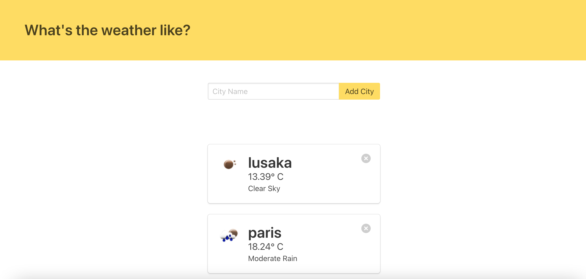

# Building a Weather App with Flask

This project will walk you through building a basic flask weather app with the OpenWeather API. Users will be able to add a city and the app will display the weather data in that particular city. This project will uncover how to work with APIs in Python.

<p>
  
</p>

**Steps to building this app:**
```
1. Create a Virtual Environment
2. Install packages (flask requests flask_sqlalchemy & python-dotenv)
3. Create a Flaskenv File and Export flask app and dev. env
4. Create Flask App
5. Get OpenWeather API Key
6. Setup Database
7. Create Model
8. Create a Route to Add a City in a DB
    i.  check for duplicate cities
    ii. verify city
    iii.check city
    iv. nofications
9. Create a Route to Get Weather of Cities in a DB
10.Create Route to delete City From DB
10.Run app
```

**Install Packages:**

`$ pipenv install flask requests flask-sqlalchemy python-dotenv`

-- or --
create a requirements.txt file and type in the following:
```
Flask
requests
python-dotenv
```

then run the following command:

`pip install - requirements.txt`

```
$ sqlite3 weather.db
sqlite> .tables
sqlite> .exit
```

```
$ python
>>> from app import db
>>> from app import City
>>> mongu = City(name='Mongu')
>>> lusaka = City(name='Lusaka')
>>> solwezi = City(name='Solwezi')
>>> db.session.add([mongu, lusaka, solwezi])
>>> db.session.commit()
>>> exit()
```

```
$ sqlite3 weather.db
sqlite> select * from city;
sqlite> .exit
```

```
import requests
from flask import Flask, render_template, request, url_for, redirect
from pprint import PrettyPrinter # built-in module

app = Flask(__name__)

open_weather_api_key = os.getenv('API_KEY')
BASE_URL = "http://api.openweathermap.org/data/2.5/weather"

printer = PrettyPrinter()

def get_weather_data(city):
    request_url = f'{BASE_URL}?q={city}&units=imperial&appid={open_weather_api_key}'
    data = requests.get(request_url).json()
    return data

data = get_weather_data('lusaka') # request made on 9 Jul, 2023

printer.pprint(data)
```

```
OUTPUT:

{'base': 'stations',
 'clouds': {'all': 0},
 'cod': 200,
 'coord': {'lat': -15.4067, 'lon': 28.2871},
 'dt': 1688879869,
 'id': 909137,
 'main': {'feels_like': 49.24,
          'grnd_level': 878,
          'humidity': 65,
          'pressure': 1021,
          'sea_level': 1021,
          'temp': 51.35,
          'temp_max': 51.35,
          'temp_min': 51.35},
 'name': 'Lusaka',
 'sys': {'country': 'ZM', 'sunrise': 1688877248, 'sunset': 1688917767},
 'timezone': 7200,
 'visibility': 10000,
 'weather': [{'description': 'clear sky',
              'icon': '01d',
              'id': 800,
              'main': 'Clear'}],
 'wind': {'deg': 74, 'gust': 3.67, 'speed': 3.13}}
```

```
import requests
from flask import Flask, render_template, request, url_for, redirect, flash
from flask_sqlalchemy import SQLAlchemy

app = Flask(__name__)
app.config['DEBUG'] = True
app.config['SECRET_KEY'] = 'thisisthesecretkey'
app.config['SQLALCHEMY_DATABASE_URI'] = 'sqlite:///weather.db'
app.config['SQLALCHEMY_TRACK_MODIFICATIONS'] = False

open_weather_api_key = os.getenv('API_KEY')
BASE_URL = "http://api.openweathermap.org/data/2.5/weather"

db = SQLAlchemy(app)

class City(db.Model):
    id = db.Column(db.Integer, primary_key=True)
    name = db.Column(db.String(50), nullable=False)

# setup database if it doesn't exist
with app.app_context():
    db.create_all()

def get_weather_data(city):
    request_url = f'{BASE_URL}?q={city}&units=imperial&appid={open_weather_api_key}'
    data = requests.get(request_url).json()
    return data


@app.route('/', methods=['GET'])
def weather_data():
    # if method is GET
    cities = City.query.all()

    weather_data = []

    for city in cities:

        data = get_weather_data(city.name)

        weather = {
            'city': city.name,
            'temperature': data['main']['temp'],
            'description': data['weather'][0]['description'],
            'icon': data['weather'][0]['icon'],
        }

        weather_data.append(weather)

    return render_template('weather.html', weather_data=weather_data)

@app.route('/', methods=['POST'])
def add_city():
    err_msg = ''
    city = request.form.get('city')

    # check if city has value
    if city:
        city_exists = City.query.filter_by(name=city).first()
        
        # check to see if the city is already in db
        if not city_exists:
            city_weather_data = get_weather_data(city)
            if city_weather_data['cod'] == 200:
                new_city = City(name=city)
                db.session.add(new_city)
                db.session.commit()
                # flash message here
            else:
                err_msg = 'City does not exist!'
        else:
            err_msg = 'City already exists in the database!'
    
    if err_msg:
        flash(err_msg, 'error')
    else:
        flash('City added successfully!')

    return redirect(url_for('weather_data'))

@app.route('/delete/<name>')
def delete_city(name):
    city = City.query.filter_by(name=name).first()
    db.session.delete(city)
    db.session.commit()

    flash(f'Successfully deleted {city.name}', 'success')
    return redirect(url_for('weather_data'))

if __name__ == '__main__':
    app.run(debug=True)
```

**Future Features:**
```
1. Create User Auth for the app
2. Each User Should Add and View their own added cities
3. Whenever you add a new city, the city should be listed as the first item, so that we dont have to scroll to the bottom of the page to check the weather of added city.
4. Probably you can add a hyperlink to the city which would take you to a different page that would show you 
the weather graph for the day, which you can generate using the pygal library
5. Add a drop down to the list that lets you sort by newest to older, sort by the time of day in that city. 
That could introduce a second API call to get time data and have it updated in the database.
```

# References

1. [Creating a Weather App in Flask Using Python Requests [Part 1]](https://www.youtube.com/watch?v=lWA0GgUN8kg&list=PL0iII0bIwvpIUC7SwtR2l09jeEUbPr4-p&index=61)
2. [Creating a Weather App in Flask Using Python Requests [Part 2]](https://www.youtube.com/watch?v=usKnUuGQHLs&list=PL0iII0bIwvpIUC7SwtR2l09jeEUbPr4-p&index=61)
3. [Build YOUR OWN Weather App in Python with Flask (COMPLETE Beginner Tutorial)](https://www.youtube.com/watch?v=JCD7YdOSsWI&list=PL0iII0bIwvpIUC7SwtR2l09jeEUbPr4-p&index=63)